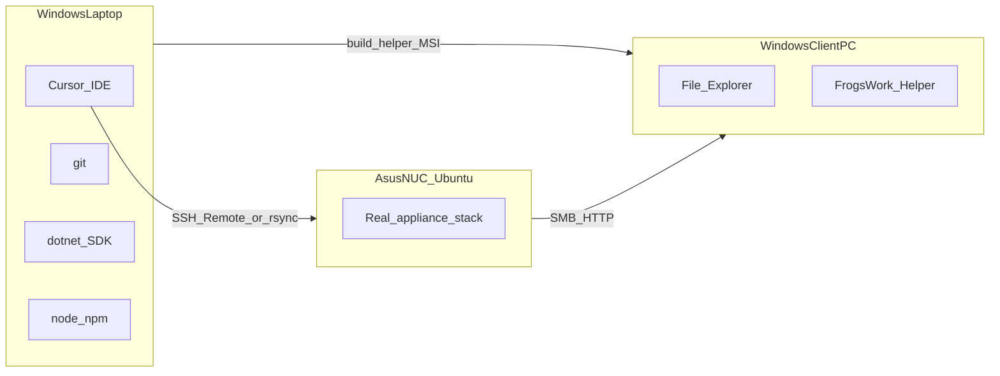

# FrogsWork File Storage — Development Behaviour Plan

This document defines **how** the product is built. It complements:

- [`PROJECT_CONTEXT.md`](../PROJECT_CONTEXT.md) — **what** and **why** (product vision)
- [Implementation plan](../.cursor/plans/frogswork_file_storage_d3d107e4.plan.md) — **architecture**, milestones M0–M9, confirmed stack decisions

When documents conflict, resolve in this order: **PROJECT_CONTEXT → implementation plan → this behaviour plan → ad-hoc agent choices**.

---

## 1. Core goals (never lose sight of these)

Every change must serve at least one of:

| Goal | Meaning |
|------|---------|
| **Goal A** | Fast, reliable shared filesystem for the workshop — all Windows desktops access the same files over SMB |
| **Goal B** | Polished plug-and-play appliance sold to non-technical SMBs — install once, works forever, reproducible manufacturing |

If a change improves internal elegance but hurts owner/employee journeys or manufacturing repeatability, **do not ship it**.

---

## 2. Development environments



| Environment | Role | Runs |
|-------------|------|------|
| **Windows laptop** | Primary dev machine | Cursor, git, Python (lint/tests only), Node (dashboard build), .NET 8 (helper build) |
| **Asus NUC** | Integration truth | Ubuntu 24.04, Samba, btrfs, nginx, FastAPI, systemd — **real stack, not mocked** |
| **Windows client PC** | User acceptance | Explorer SMB, helper app, drive mapping |

**Rules:**
- The NUC does **not** run Cursor or an AI agent. Deploy via SSH from the laptop.
- **Never** simulate Samba/btrfs/snapshot behaviour on Windows — test on the NUC.
- Dashboard and helper can be built locally; backend integration tests that touch Samba/btrfs run on NUC (or in CI with mocked integrations until NUC CI exists).
- Prefer **Remote-SSH** in Cursor to edit/deploy on the NUC for integration work.

---

## 3. Session workflow (agent or human)

Every work session follows this sequence:

### 3.1 Start of session

1. Read [`PROJECT_CONTEXT.md`](../PROJECT_CONTEXT.md) if product scope is in question.
2. Read the [implementation plan](../.cursor/plans/frogswork_file_storage_d3d107e4.plan.md) — confirm current milestone and what is in/out of scope.
3. Read this behaviour plan.
4. Check `git status` and recent commits — understand what already landed.
5. State which **milestone** (M0–M9) and **deliverable** you are working on.

### 3.2 Before writing code

- Confirm the change maps to the current milestone (do not jump ahead unless user explicitly reprioritizes).
- If the change touches a **major fork** (see §8), **stop and ask** — do not implement first.
- If requirements are ambiguous, **ask early** — one focused question beats a wrong implementation.
- For non-trivial work, briefly state: files to touch, approach, and how it will be tested.

### 3.3 During implementation

- **One concern per commit** — see §6.
- Match existing conventions in the file you are editing.
- Keep module boundaries clean: API logic ≠ Samba shell calls ≠ React UI.
- No magic: config in known files (`/etc/samba/`, `/var/lib/frogswork/`, env documented in README).
- No imports from legacy `NASproject` prototype.

### 3.4 Before finishing a session

1. Run relevant tests (§7).
2. If integration feature: smoke-test on NUC or document what the user must verify.
3. Commit if user requested commits and work is a complete conceptual unit.
4. **Update [`docs/dev-steps/M*.md`](dev-steps/README.md)** for the milestone you worked on — mark steps done, record commits, note deviations.
5. Summarize: what changed, what milestone progress, what is next, any blockers.

---

## 4. Milestone-driven delivery

Work **in order** unless the user explicitly reorders:

| Milestone | Focus | Dev behaviour |
|-----------|-------|---------------|
| **M0** | Scaffold | `.gitignore`, branding rework, empty templates — **no business logic yet** |
| **M1** | Provisioning | Scripts must be **idempotent** and safe to re-run; test on NUC |
| **M2** | Backend core | Setup wizard + admin auth + SQLite; API-first before dashboard polish |
| **M3** | Users + Samba | Every user op goes through sync layer; test SMB login on client PC |
| **M4** | Folders + ACLs | Permission matrix is single source of truth; verify ro/rw in Explorer |
| **M5** | Dashboard UI | React pages consume existing API; no duplicate business logic in frontend |
| **M6** | Snapshots | Timer + retention + restore; verify delete → restore journey |
| **M7** | System page | SSH toggle default off; guarded reboot |
| **M8** | Helper app | mDNS + drive letters U:/S:; test on real LAN |
| **M9** | Hardening | Second-unit install, release tag, manufacturing doc |

**Do not** mark a milestone done until its "Validates" column in the implementation plan passes on real hardware (or is explicitly deferred with user approval).

---

## 5. Component boundaries and testability

Each layer must be independently testable:

```
dashboard/          → HTTP client only; no direct Samba/btrfs knowledge
backend/frogswork_api/
  routes/           → HTTP in/out, validation, auth
  services/         → business rules (permissions matrix, quotas)
  integrations/     → ONLY layer that shells out: useradd, smbpasswd, btrfs, setfacl
helper/             → HTTP + mDNS + WNetAddConnection2; no dashboard admin APIs
scripts/            → idempotent install/provision; no Python import from backend at runtime
```

**Integration layer rules (`integrations/`):**
- Wrap all subprocess/filesystem mutations in small functions with clear inputs/outputs.
- Log commands at INFO in dev; never log passwords.
- Raise typed errors the API can translate to plain-language dashboard messages.

**Test pyramid:**

| Level | Where | What |
|-------|-------|------|
| Unit | Laptop (`pytest`) | Services, permission logic, retention math, API validation |
| Integration | NUC | Samba auth, ACL enforcement, btrfs snapshot create/list/restore |
| E2E | NUC + Windows client | Setup wizard → create user → helper maps drive → read/write → snapshot restore |

Add unit tests when logic is non-trivial. Do not add tests that only assert mocks call mocks.

---

## 6. Git discipline

### Commit rules

Every commit must:
- Represent **one conceptual change** (one feature slice, one fix, one doc update)
- Be describable in one sentence
- Avoid bundling unrelated files (e.g. backend + helper + random formatting)

### Message format

```
<area>: <what changed and why in imperative mood>
```

Examples:
- `M0: add repo skeleton and gitignore for python, node, dotnet`
- `M3: sync file user creation to linux account and smbpasswd`
- `M6: add nightly snapshot timer and retention script`

### When to commit

- After user approval of the overall plan (already given for implementation plan).
- After each complete, working slice within a milestone.
- **Never** commit secrets (`.env`, passwords, private keys).
- **Never** commit build artifacts (`dist/`, `__pycache__/`, `bin/`, `obj/` — enforced by `.gitignore`).

### Branching (recommended)

- `main` — stable, manufacturing-ready tags cut from here
- Feature branches optional for large milestones; merge with clean history
- Tag releases: `v0.1.0-m1`, `v1.0.0` aligned with [`VERSION`](../VERSION) file

---

## 7. Deploy and sync workflow

### Laptop → NUC deploy (during development)

```bash
# From repo root on laptop — exact script TBD at M1/M2
scripts/dev/sync.sh          # rsync code to NUC
scripts/install/02-deploy-app.sh   # rebuild + restart services on NUC
```

After deploy, always verify:
```bash
curl http://frogswork.local/api/health
systemctl status frogswork-api nginx smbd
```

### Dashboard dev loop

- Local: `cd dashboard && npm run dev` with API proxy to NUC or local backend
- Production-like: `npm run build` → deploy static `dist/` via install script

### Helper dev loop

- Build on laptop: `dotnet build helper/FrogsWork.Helper`
- Copy MSI/exe to NUC `/var/lib/frogswork/helper/` for dashboard download
- Install on Windows client PC; test against real appliance IP or `frogswork.local`

### Manufacturing deploy (M9)

Documented in [`docs/install-manufacturing.md`](install-manufacturing.md):
1. Manual Ubuntu 24.04 install
2. `git clone --branch vX.Y.Z`
3. Run `scripts/install/00` → `01` → `02` → `03` in order
4. Smoke test checklist

---

## 8. Decision gates — ask before proceeding

Pause and ask the user when considering:

| Category | Examples |
|----------|----------|
| Stack forks | FastAPI vs Flask, React vs SvelteKit, Python helper vs C# |
| Data model | Samba-only users vs Linux passwd sync (plan: sync both) |
| Security | Opening SSH by default, storing plaintext passwords, skipping ACL sync |
| Snapshot policy | Per-folder vs whole-volume snapshots (plan: whole-volume v1) |
| Discovery | mDNS service type, fallback if Bonjour blocked |
| Breaking changes | Renaming repo folders, changing `/data` layout, partition scheme |
| Scope creep | Docker, cloud sync, Mac helper, HTTPS, AD integration |

**Do not ask** about decisions already in the implementation plan decisions log (React, C#, HTTP-only, FrogsWork branding, etc.) unless proposing to change them.

---

## 9. Code and UX principles

### Simplicity over cleverness

- Non-technical owners use the dashboard — plain language, no jargon ("Snapshot" not "btrfs subvolume").
- Prefer boring, well-understood tools (systemd, nginx, SQLite) over frameworks.

### Low coupling

- Dashboard never calls `subprocess` or edits `/etc/samba/` directly.
- Backend never embeds React components.
- Helper never implements admin features.

### Predictability

- Install scripts print what they will do; support `--dry-run` where destructive.
- API errors return structured JSON `{ "detail": "..." }` suitable for UI display.
- File paths are constants in one module (`paths.py`), not scattered strings.

### Reliability over elegance

- If integration fails halfway (user created in DB but Samba failed), roll back or retry — document transaction strategy in M3.
- Services must survive reboot (`systemctl enable` verified in M1).

---

## 10. Security behaviour during development

- **Remote SSH off by default** on customer units; enable only via dashboard toggle for support.
- No baked-in KorraOne SSH keys on shipped appliances.
- Do not log credentials, smbpasswd input, or JWT secrets.
- Admin dashboard auth separate from SMB file users (see implementation plan § user model).
- Helper MSI unsigned for v1 — document SmartScreen warning for testers.

---

## 11. Documentation expectations

Update docs **in the same milestone** as the code they describe:

| Doc | Updated when |
|-----|--------------|
| [`README.md`](../README.md) | M0, M9 |
| [`docs/dev-steps/`](dev-steps/README.md) | **After each milestone** — update status, commits, deviations in the matching `M*.md` |
| [`docs/architecture.md`](architecture.md) | M1, major arch changes |
| [`docs/install-manufacturing.md`](install-manufacturing.md) | M1, M9 |
| [`docs/development-behaviour.md`](development-behaviour.md) | M0; revise if workflow changes |
| OpenAPI / [`docs/api.md`](api.md) | Each backend milestone |

Do not create markdown files the user did not ask for unless they are listed above or required by the milestone.

---

## 12. Agent-specific behaviour (Cursor)

When acting as implementing agent:

1. **Read first** — PROJECT_CONTEXT + implementation plan + this doc before code.
2. **Summarize understanding** when starting a new milestone or after long gaps.
3. **Use tools** — run commands, inspect files; do not guess repo state.
4. **Execute real environment** — user rules require running commands, not just suggesting them.
5. **Plan mode** — if user is iterating on plans, update plan docs only; no code until explicit "execute the plan" / "start implementing".
6. **Proportional responses** — small fix = small diff; no drive-by refactors.
7. **No legacy code** — never copy from old `NASproject` repo.
8. **Workspace paths** — use repo-relative paths; manufacturing scripts must work on fresh Ubuntu.

---

## 13. Definition of done — per change (not just v1)

Before marking any task complete:

- [ ] Code matches approved architecture and milestone scope
- [ ] No unrelated files changed
- [ ] `.gitignore` covers new build outputs
- [ ] Tests run (or manual NUC verification documented)
- [ ] Owner or employee journey still works end-to-end if touched
- [ ] Install scripts remain idempotent if touched
- [ ] No secrets committed

---

## 14. v1 product definition of done (reference)

From PROJECT_CONTEXT — the **project** is done when all six items pass on **two identical NUCs**:

1. Fresh install from documented scripts
2. Owner setup wizard + user/folder management
3. Helper app drive mapping + Explorer read/write
4. Nightly snapshots + dashboard restore
5. Reboot survival without manual steps
6. Second unit built with same process

---

## Relationship to implementation plan

| Implementation plan section | This behaviour plan section |
|-----------------------------|----------------------------|
| Tech stack | §2 environments, §5 boundaries |
| Milestones M0–M9 | §4 milestone delivery |
| User/permission model | §5 services layer, §9 UX |
| Install workflow | §7 deploy, §11 docs |
| SSH policy | §10 security |
| Git (implicit) | §6 git discipline |
