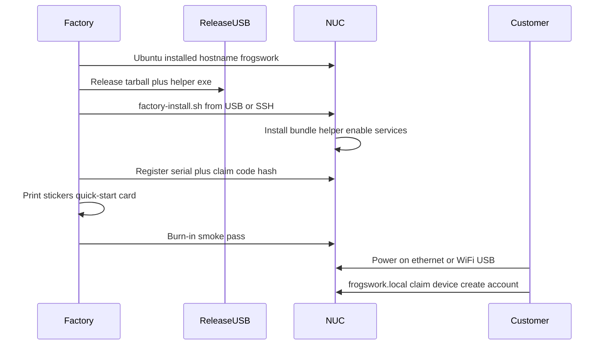

# Factory deploy pipeline

How FrogsWork ships on a complete boxed appliance. **Polish ships first**; factory automation builds on this doc.

## Business model

- One-time purchase of a complete box (appliance + cables + WiFi setup USB + quick-start card)
- No subscription for core file storage
- Customer paths: **Ethernet** (primary) or **WiFi setup USB** (alternative)

## Factory line overview



## Release artifact (not git clone)

Ship `frogswork-vX.Y.Z.tar.gz` containing:

| Path | Contents |
|------|----------|
| `backend/` | Python API |
| `dashboard/dist/` | Prebuilt static dashboard |
| `helper/FrogsWork.Helper.exe` | Windows helper |
| `scripts/install/` | `00`–`03` install scripts |
| `scripts/factory/` | Factory-only scripts |
| `deploy/` | nginx, systemd, avahi, sudoers |
| `VERSION` | Release pin |

Factory floor does **not** need Node.js or git.

## Install paths

### A) SSH (factory bench with network)

```bash
scp frogswork-v1.0.0.tar.gz nuc:/tmp/
ssh nuc
sudo tar -xzf /tmp/frogswork-v1.0.0.tar.gz -C /opt/frogswork --strip-components=1
sudo bash /opt/frogswork/scripts/factory/factory-install.sh \
  --serial FW-2026-00042 \
  --claim-code FW-7K3M-9P2Q
```

### B) USB (no network on bench)

1. Copy release tarball to factory USB
2. Boot NUC, insert USB
3. Run `sudo bash /media/usb/frogswork/scripts/factory/factory-install.sh` (or udev-triggered one-shot)

## `factory-install.sh` responsibilities

Wrapper around [`scripts/install/install.sh`](../scripts/install/install.sh) that also:

1. Runs `00`–`03` install scripts
2. Copies `FrogsWork.Helper.exe` to `/var/lib/frogswork/helper/`
3. Seeds `device_identity` (serial + claim code hash) — see [onboarding-design.md](onboarding-design.md)
4. Removes dev deploy users; disables passwordless sudo for non-root
5. Applies SSH hardening drop-in (remote off until owner enables support)
6. Runs burn-in: `scripts/dev/smoke-m9.sh` (adapted for factory)
7. Appends row to unit registry CSV — see [retail-kit-and-labels.md](retail-kit-and-labels.md)

Skeleton: [`scripts/factory/factory-install.sh`](../scripts/factory/factory-install.sh)

## Customer first boot

1. Unbox → plug power (+ ethernet **or** WiFi USB per quick-start card)
2. Browser → `http://frogswork.local` (or IP from router)
3. Setup wizard: **claim code** → email/password → timezone
4. Auto sign-in → Dashboard

No SSH required for the customer.

## Sticker and registry

- **Serial** on permanent label (support, warranty)
- **Claim code** on card inside box (one-time setup secret)
- Unit registry spreadsheet — columns in [retail-kit-and-labels.md](retail-kit-and-labels.md)

## WiFi setup USB (retail kit)

See [wifi-usb-provisioning.md](wifi-usb-provisioning.md).

Retail USB includes:

- `WiFi Setup.html` — customer fills SSID/password on PC
- `README.txt` — ethernet vs WiFi paths
- NUC writes `frogswork-setup.log` + `frogswork-setup.status` back for diagnostics

## CI / release

| Step | Tool |
|------|------|
| Tag `vX.Y.Z` | Git |
| Build dashboard + helper | GitHub Actions ([`.github/workflows/ci.yml`](../.github/workflows/ci.yml)) |
| pytest | CI |
| Assemble tarball + SHA256 | `scripts/release/build-tarball.sh` |
| Factory pulls tagged release | USB mirror |

## Related docs

- [install-manufacturing.md](install-manufacturing.md) — dev/NUC install (current)
- [onboarding-design.md](onboarding-design.md) — claim code + email admin API
- [wifi-usb-provisioning.md](wifi-usb-provisioning.md) — USB WiFi + log write-back
- [retail-kit-and-labels.md](retail-kit-and-labels.md) — box contents, stickers, warranty
- [known-issues.md](known-issues.md) — manual QA checklist
